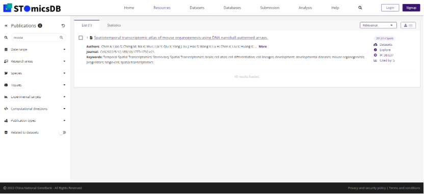

数据及元数据标准
==============

数据及元数据标准

4.2.  如何递交原始数据
将原始测序的时空转录组学数据递交至STOC，用户除了需要提供原始数据，还需要提供描述测序数据元数据信息以便用户递交的数据可以被更好的检索和复用。
用户可以通过参阅下述网址中的方式进行原始数据递交：
https://db.cngb.org/stomics/submission
以下章节将会帮助用户了解需要递交哪些数据，同时下述网址中可以查阅递交模板：
https://ftp.cngb.org/pub/stomics/

+------------------------+----------------------------+
|Field Name	         |Note                        |
+========================+============================+
|Stereo-seq Fastq	 |时空测序芯片测序文件，.Fastq|
+------------------------+----------------------------+
|Stereo chip mask	 |数据文件，支持.h5和.bin后缀 |
+------------------------+----------------------------+
|microscope slide image	 |图像文件，.tiff或.tif       |
+------------------------+----------------------------+
我们约定了时空转录组学测序的原始文件类型，包括时空测序芯片测序文件FASTQ，FASTQ是一种基于文本的格式，用于存储生物序列（通常是核苷酸序列）及其相应的测序质量分数。时空定位芯片掩模文件，用二进制格式.bin或.h5格式，用于存放和记录时空定位芯片测序的探针序列及其空间分布，后续与时空测序数据进行比对，从而确定时空测序技术捕获到的分子在空间上的分布情况。时空测序影像，利用图像学中通用的图像文件格式TIFF或TIF，是一种用于存储时空转录组测序前拍摄的显微影像，用于后期与时空转录组测序数据进行配准。

4.4.  递交标准分析结果文件

+----------------------------------+-------------------------------------+
|Field Name                        |Note                                 |
+==================================+=====================================+
|raw feature-spot matrix           |矩阵文件名，支持.gem和.gef后缀       |
+----------------------------------+-------------------------------------+
|filtered feature-spot matrix      |矩阵文件名，支持.gem和.gef后缀       |
+----------------------------------+-------------------------------------+
|cell annotation                   |注释文件                             |
+----------------------------------+-------------------------------------+
|binsize                           |格式校验                             |
+----------------------------------+-------------------------------------+
|cell bin                          |支持列举的值填写                     |
+----------------------------------+-------------------------------------+
|MD5.list                          |MD5文件                              |
+----------------------------------+-------------------------------------+
|Mapping                           |比对结果文件                         |
+----------------------------------+-------------------------------------+
同时我们也约定了标准分析结果文件，它包括上述表格中的文件类型。其中，原始表达矩阵，即时空转录组学标准分析结果得到的时空转录组基因表达矩阵，filtered后的表达矩阵包括不限于按照组织轮廓切割、按照组织的最大外接矩形切割的表达矩阵等。基因表达矩阵文件用于存储基因的空间表达数据。Stereo-seq技术的SAW 流程中生成的GEF 文件可通过小工具转换成纯文本表格格式基因表达矩阵（GEM），基本格式为含表头的四列
数据，分别为基因名称、x 坐标、y 坐标、和MID 数。表达矩阵中原点位置校准至（0，0）。基因表达矩阵的表头部分包含六行以“#”开头的注释信息。表头字段说明见表**。

