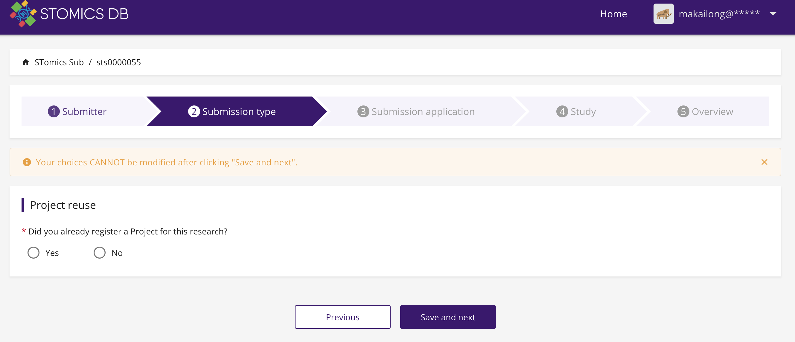
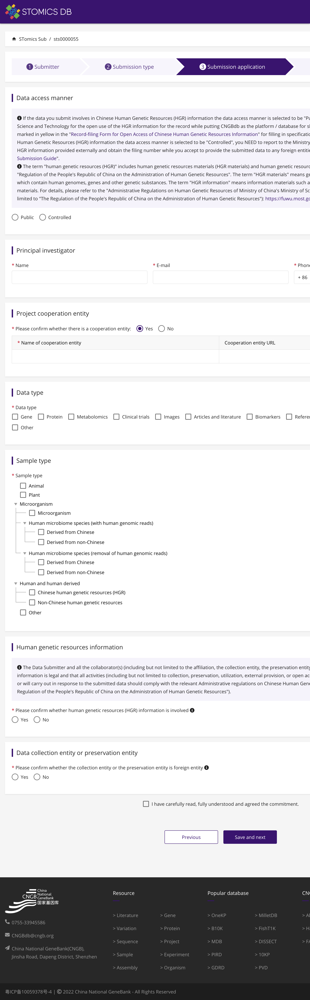

时空组学联盟STOC数据门户服务
=================

数据汇归(Submission)
--------------------
关于STOmicsDB数据汇交归档标准约定了以下5个重要步骤，包括:**Submitter、Submission type、Submission application、Study、Overview**

**Submitter**
在Submitter步骤中，递交者应该提供相应的与自身相关的联系方式，包括姓名、电子邮件、电话号码、所在通讯地址、部门组织信息等。

**Submission type**
在Submission type步骤中，递交者可以选择已经注册过的项目，亦或是新建一个注册项目。

**Submission application**

若新建一个注册项目，在Submission application板块可需根据《中华人民共和国人类遗传资源管理条例》声明数据访问形式是公开，还是以受控形式进行访问。并提供联系方式及声明合作单位信息，数据类型及样品类型，以及声明数据是否涉及人类遗传资源HGR信息和数据收集实体或保存实体情况。

其中数据类型包括：

Gene
Protein
Metabolomics
Clinical trials
Images
Articles and literature
Biomarkers
Reference materials
Public data from a public database
Other

其中样品类型包括：

**Sample type**
**Animal**
**Plant**
**Microorganism**
Microorganism
**Human microbiome species (with human genomic reads)**
Derived from Chinese
Derived from non-Chinese
**Human microbiome species (removal of human genomic reads)**
Derived from Chinese
Derived from non-Chinese
**Human and human derived**
Chinese human genetic resources (HGR)
Non-Chinese human genetic resources
Other

**Study**
在Study板块，需要完善项目信息，包括一段总结和项目数据类型，样本信息。项目数据类型包括：
Genome sequencing and assembly
Raw sequence reads
Genome sequencing
Assembly
Clone ends
Epigenomics
Exome
Map
Metagenome
Metagenomic assembly
Phenotype or genotype
Proteome
Random survey
Targeted loci cultured
Targeted loci environmental
Targeted locus (Loci)
Transcriptome or gene expression
Variation
Metabolome
STomics
Other

在本步骤，还需要提供递交者的信息、该成果发行的出版集团信息以及相关的实验和项目信息等。

**Overview**
在此步骤，可以预览上述所有步骤中递交的内容，并最终完成时空标准数据递交。

.. image:: ./images/5.0.3.png

数据集数据库(Dataset/Collection)

--------------------------------
数据标准化/审编流程——展示可视化方式
----------------------------------

数据工具(Tools)
--------------

5.1.门户概述
-----------
时空联盟数据门户网站空间转录组学数据库(STOmics DB)是与空间转录组学主题相关的文献和数据集的综合数据库及联盟门户，并为数据查看、分析和可视化提供了方便的工具。

5.2.门户资源中心
---------------
联盟数据的门户设立了以资源中心为集合的出版物、工具、作者、技术、数据集板块。这些部分组合成了时空联盟数据中心，通过实时的出版物收录将涵盖全球行业内所有与时空组学相关已公开发表的文献，汇总这些学术成果以便提供具有代表性的行业学术动向。通过工具集合板块收录行业内相关工具集，提供时空分析前沿工具能力的保障。通过汇集作者列表，形成时空联盟专家库，汇集时空领域人才和专家团队。通过技术板块归纳和反应时空组学相关的技术及成果，总结行业历史及发展动向。

5.3.出版物集合
-------------
STOC时空组学联盟是一项大胆的尝试，旨在汇集全球时空组学技术及其最新成果并以联盟的形式管理和推进全球时空组学技术的发展。其中时空组学技术出版物是奠定了时空组学技术历史成果和最新成果的一个重要途径，STOC数据门户规划和创办了出版物集合板块，将热门时空技术文献收录，并参考PubMed Unique Identifier提供PubMed搜索引擎中收录的生命科学和医学等领域文献唯一识别编号，Impact Factor影响因子数据，Cited by引用次数，以及可能有的对应的数据集，并可将上述信息提供下载。同时也提供用机器学习方法获取的文献相关关键字，这些关键字信息库总共有包括生命科学领域的XXX个分类，对应归集和整理了不同物种信息的分类，这些分类标准共有XXX个。并将所收录的文献用机器学习的方法与其相似的文章、工具、技术及工具集进行关联收录。

.. image:: ./images/5.3.3.png

5.4.工具集合
------------
STOC联盟数据门户不仅对已公开发表的文献进行收录，同时还会收录与之相关或未经发表文献但已公开发表的时空组学相关工具，形成STOC联盟时空工具库，在此记录工具应用数，更新时间及工具介绍，记录工具收录出处如公开的github地址、DOIs、编程语言等，用机器学习识别的工具关键字分类，未来STOC将致力于将这些工具进行测评比较，并挑选出时空组学技术热门工具。

5.5.作者集合
------------
STOC联盟致力于扩大联盟及成员组织，包括不限于人才、专家组、科学团体等形式，其中STOC联盟数据门户作者库是搜集来自前言时空技术文章的作者信息，在此组织和记录了该作者姓名、单位、通讯信息、其文章引用情况、时空技术文章数量、ORCID、其研究领域、其与其他时空技术作者联合发表文章的关系数量及相关的文献、工具及关联数据集。旨在通过上述信息描述时空作者专家信息，并形成具有科研影响力的专家科学团体。

.. image:: ./images/5.5.png

5.6.技术集合
-----------
时空组学技术是时空联盟STOC研究的核心，联盟数据门户不断关注和迭代更新时空技术，并收录其具有代表性的文献、商业化技术介绍、工具等，对每个时空组学技术进行描述、对已公开发表文献的记录其PMID、优势、缺点、评价、并利用机器学习方法对其进行关键词提取分类，定义其空间分辨率情况等。

5.7.科学数据集
------------------
STOC时空联盟对汇交的时空技术数据进行归纳整理形成完整的科学数据集，对每一个递交整理的科学数据集配备数据集描述、对应时空技术种类、测序平台、物种信息、组织切片信息、引用的文献信息、递交的时间、组织样本数量、科学数据库访问地址、PMID、CNSA递交编号及基因数量、捕获位点数等信息。

5.8.科学数据库
-------------
时空组学联盟STOC旨在为更多的时空组学技术专题文献制作和收纳科学数据库，这是一个强大的功能，科学数据库为用户提供了可视化形式展示的数据库类型，用户可以了解到这项科学研究的背景介绍、这个项目的时空技术信息、所用到的工具信息、项目及数据集信息、数据下载渠道、时空数据聚类信息。不但如此，还可以以交互的形式对任意基因进行挖掘和探索这些数据在空间上的相对分布情况，从而进一步探索带有空间位置信息的转录组表达情况。

5.9.数据递交
---------------

5.10.在线分析
------------

