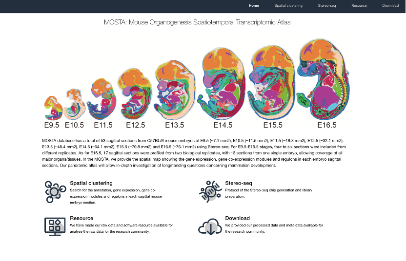
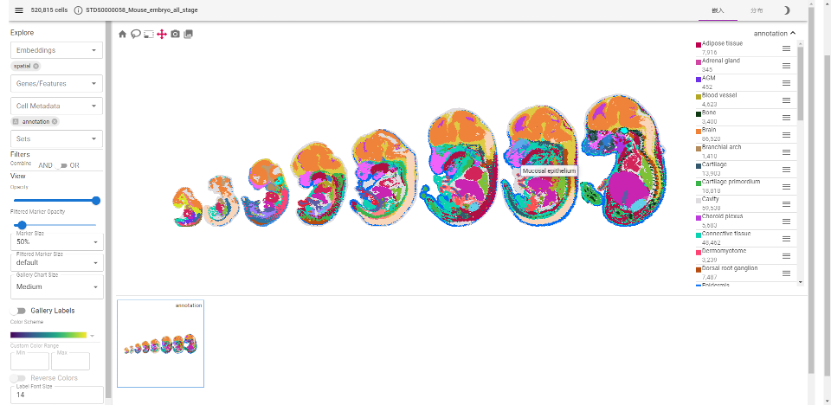
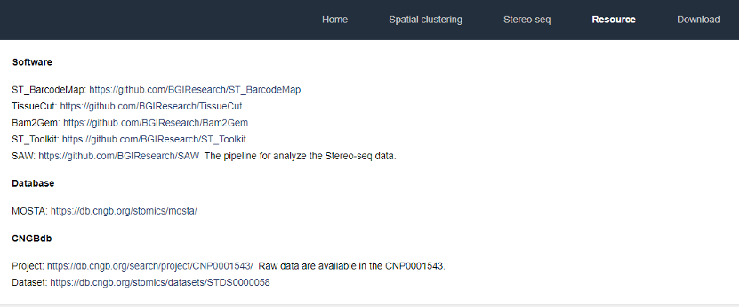
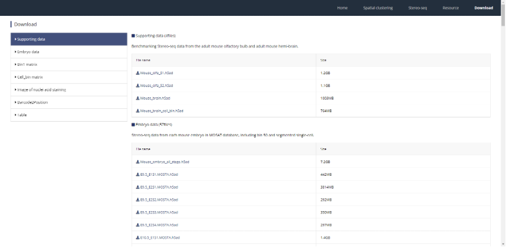
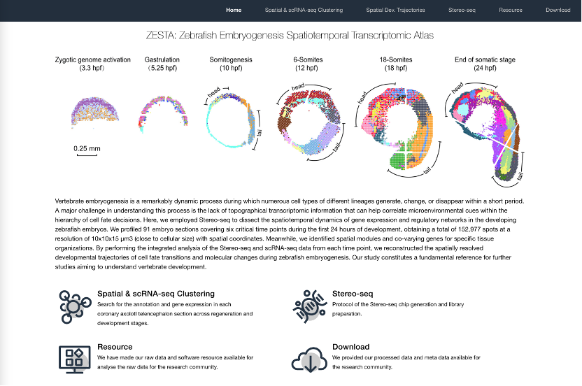
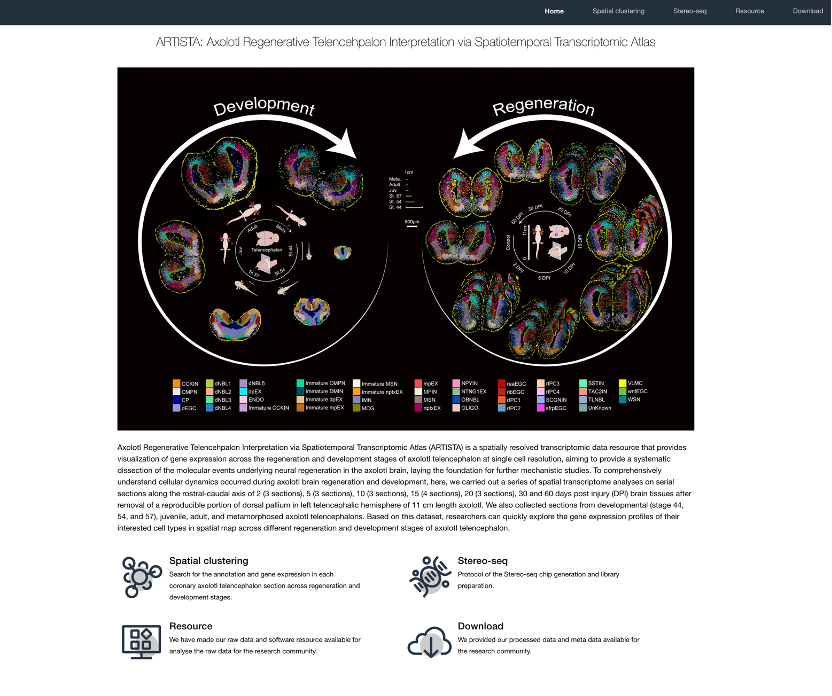
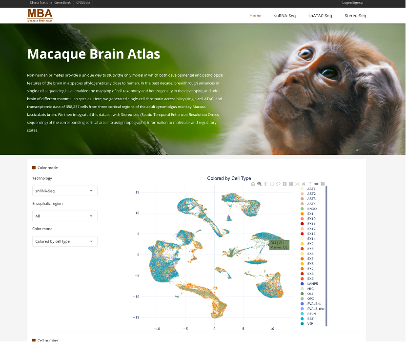
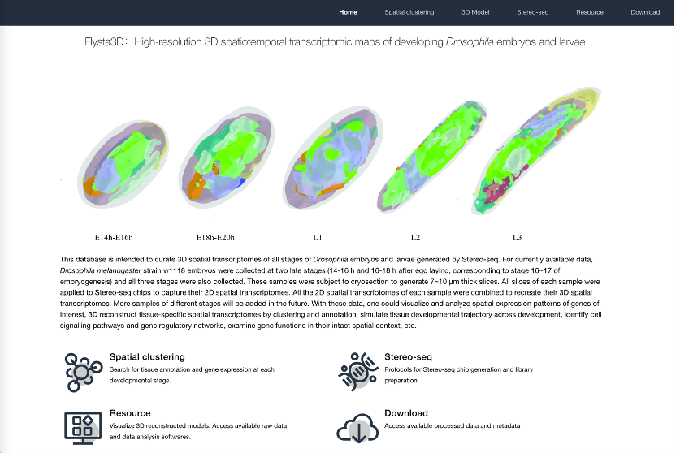

案例和最佳实践
============

6.1.MOSTA
---------
  MOSTA科学数据库一共有53个来自C57BL/6小鼠胚胎的矢状面切片，分别为 E9.5 (~7.1 mm2)、E10.5 (~11.5 mm2)、E11.5 (~18.8 mm2)、E12.5 (~32.1 mm2) )、E13.5 (~48.4 mm2)、E14.5 (~64.1 mm2)、E15.5 (~70.8 mm2) 和 E16.5 (~76.1 mm2) 时期，使用了 Stereo-seq技术。对于 E9.5至E15.5 阶段，从不同的复制中取四到六个切片。E16.5，从两个生物重复样本中取17个矢状切片，从一个胚胎中取13 个切片，覆盖了所有主要器官和组织。在 MOSTA 中，给用户提供了每个胚胎矢状切片中基因表达、基因共表达和调节子的可视化空间图，可通过以下地址访问：https://db.cngb.org/stomics/mosta/。

  在此，MOSTA科学数据库提供了时空转录组聚类，在每个矢状小鼠胚胎切片中搜索注释、基因表达、基因共表达模块。提供了MOSTA项目数据及元数据下载。也提供了项目所应用到的软件工具，让用户可以复用数据并复现项目。

6.2.ZESTA
---------

6.3.ARTISTA
-----------

6.4.ACSTA
---------

6.5.MBA
--------

6.6.Flysta3D
------------

